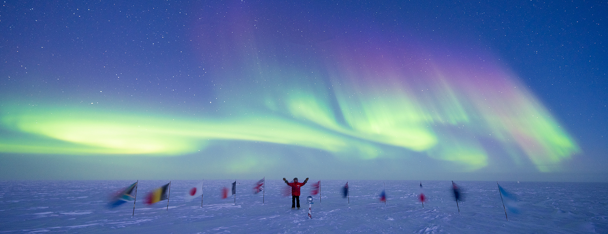

---
I'm a radio astronomer at
[McGill](https://www.physics.mcgill.ca/research/astro.html) and the
[Trottier Space Institute](https://tsi.mcgill.ca) studying the origin of the
first light in our Universe. Using telescopes such as the
[Murichison Widefield Array](https://www.mwatelescope.org/) and the upcoming
[Square Kilometer Array](https://www.skao.int/en) I search for these primordial
signals. I work on interferometry, calibration, and instrumental and
environmental systematics, alongside the development of open-source tools for
data analysis and simulation. I've spent over a year at the South Pole, and
have recently been involved with the ALBATROS telescope near the magnetic
North Pole ✨

I’m interested in data visualisation, scientific software, and astrophotography,
and am currently learning Rust and French. Reach out to collaborate or chat!

---

