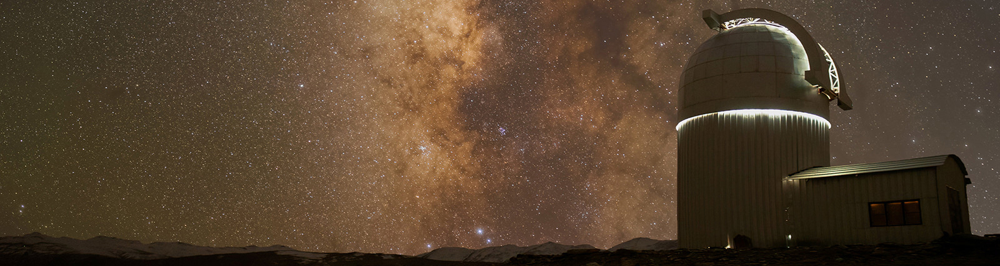

<!-- ### :new_moon: :waxing_crescent_moon: :first_quarter_moon: :waxing_gibbous_moon: :full_moon: :waning_gibbous_moon: :last_quarter_moon: :waning_crescent_moon: :new_moon: -->

<!-- 
<h3 style="text-align:center">🌑 &nbsp&nbsp🌒&nbsp&nbsp 🌓&nbsp&nbsp 🌔&nbsp&nbsp 🌕&nbsp&nbsp 🌖&nbsp&nbsp 🌗&nbsp&nbsp 🌘&nbsp&nbsp 🌑</h3>
 -->

---
I'm a radio astronomer at the 
[@unimelb](https://astro.physics.unimelb.edu.au/), 
[@astro3d](https://astro3d.org.au/) & 
[@csiro](https://www.csiro.au/en/research/technology-space/astronomy-space) 
studing the origin of the first light in our Universe. Using telescopes such
as the [Murichison Widefield Array](https://www.mwatelescope.org/) and the 
upcoming [Square Kilometer Array](https://www.skao.int/en) I attempt to 
detect these promodial signals

---

